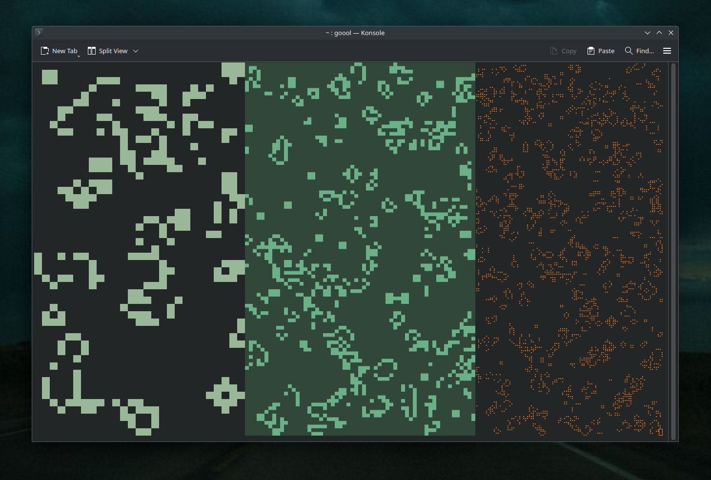

# CLI Game of Life (screensaver)



### Usage example:

```
goool --cell-type small --delay 200 --alive-color 8a8 --dead-color 000000
```

### Tasks
- [x] Argument parsing without clap and in a separate module
- [ ] Random colors
- [ ] Add visual effects
    - [ ] Gradients
    - [ ] Smooth color changing